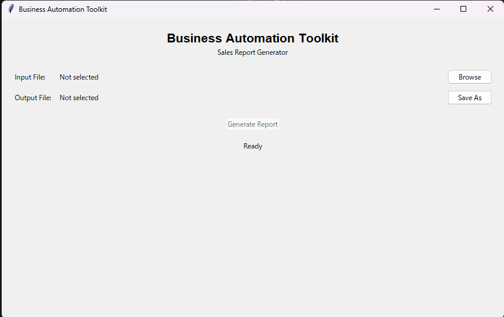

# Business Automation Toolkit

Pythonを使用した業務自動化ツール集です。

第一弾として、CSV・Excelファイルから売上データを読み込み、自動で集計・分析し、見やすいExcelレポートを生成する「Sales Report Generator」を開発しました。

---

# プロジェクト概要

Business Automation Toolkitは、日常業務で繰り返される作業を自動化し、作業時間の短縮や入力ミスの削減を目的としたPython製デスクトップアプリケーションです。

本プロジェクトでは、単に動作するだけではなく、

- 保守しやすい設計
- テストしやすい構成
- 責務を分離したアーキテクチャ

を重視して開発しています。

---

# 主な機能

## Sales Report Generator

- CSV（.csv）対応
- Excel（.xlsx）対応
- UTF-8 / CP932対応
- 売上データの自動検証
- 売上計算
- 担当者別集計
- 商品別集計
- 月別集計
- Excelレポート自動生成
- GUI（Tkinter）対応

---

# スクリーンショット
## GUI


※後ほど追加予定

- GUI画面
- レポート生成画面
- 出力されたExcel

---

# アーキテクチャ

```
GUI
 │
 ▼
SalesReportService
 │
 ▼
SalesDataReader
 │
 ▼
SalesDataValidator
 │
 ▼
SalesAnalyzer
 │
 ▼
SalesReportExporter
 │
 ▼
Excel Report
```

---

# 使用技術

- Python
- pandas
- openpyxl
- Tkinter
- pytest
- Ruff

---

# テスト

品質維持のため、自動テストを導入しています。

```
pytest
```

静的解析

```
ruff check .
```

現在の状況

- 自動テスト：103件成功
- Ruff：エラー0件

---

# 実行方法

リポジトリを取得

```bash
git clone https://github.com/dan-kichi99/business-automation-toolkit.git
```

ライブラリをインストール

```bash
pip install -r requirements.txt
```

アプリを起動

```bash
python app.py
```

---

# 今後追加予定

- PDF Organizer
- Excel Formatter
- File Renamer
- その他の業務自動化ツール

---

# ライセンス

MIT License
